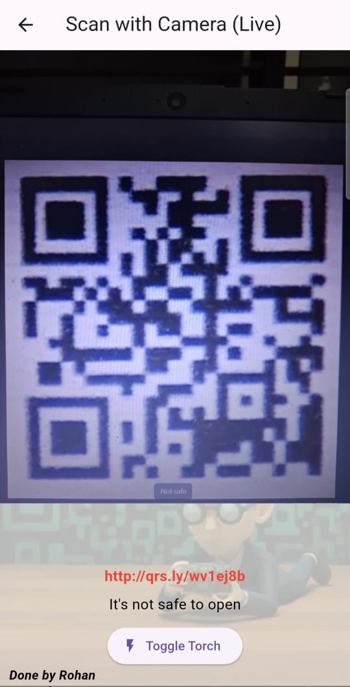

## **QRystal**

##  Overview

QRystal is a mobile application designed to detect QR code fraud by scanning and verifying URLs encoded within QR codes. The app ensures safe browsing by classifying scanned links as **Safe** or **Malicious** using an on-device machine learning model. Its goal is to protect users from phishing attacks and fake websites.

<p align="center">
  
  <br>
  
</p>

## Features


*    Real-time QR code scanning using the device camera
*    On-device ML model to classify safe vs suspicious URLs
*    Instant fraud detection with clear results to the user
*    Works offline after installation — no need for internet for model inference
*    User-friendly mobile UI built for fast and secure usage


## Project Structure

The project is divided into two main components:

### 1. Backend (ML Model Training)

Located in the \`backend/training\` directory, this component is responsible for:

- **Data Preparation**: URLs dataset cleaned and labeled as safe or malicious for model learning (\`prepare_dataset.py\`)
- **Model Training**: ML model trained using classification algorithms on extracted URL features (\`train_model.py\`)
- **Model Conversion**: Trained model converted to TensorFlow Lite (TFLite) for mobile compatibility (\`convert_to_tflite.py\`)
- **Model Testing**: Model evaluated with accuracy and confusion matrix to ensure reliable predictions (\`test.py\`)


### 2. Frontend – Mobile Application

Flutter-based Android application that scans QR codes and sends the extracted URL to the on-device ML model for classification and displays results.
<p align="center">
  
  <br>
  <em>UI</em>
</p>


## How It Works

*   User opens the app and taps Scan QR
*   The camera detects and reads the QR code instantly
*   The extracted URL is preprocessed and converted into model-compatible features
*   The TFLite model classifies the URL as Safe or Malicious
*   App shows result with a visual indicator and warning message if risky
*   User can choose to open or block the link based on the result
*   All processing happens securely on device — no external data sharing


## Performance

The model provides strong accuracy in distinguishing safe URLs from malicious ones such as phishing or suspicious domains. All predictions run locally on the device in milliseconds, delivering immediate security feedback without internet connectivity. This ensures fast operation and strong privacy protection.

## Result


<p align="center">
  
  
  <br>
  <em>Secure QR Code</em>
</p>

<p align="center">
  
  
  <br>
  <em>Harmful QR Code</em>
</p>


### Prerequisites

- Flutter SDK installed for mobile development

- Android device (Android 7.0 or above) for testing

- Google Camera permissions enabled for QR scanning

- TFLite runtime support for on-device model inference

- Internet required only once to install the APK (after that offline support)

### Installation

1. Clone this repository
2. Set up the Flutter environment:
   ```
   cd mobile_app
   flutter clean
   flutter pub get
   ```
3. Run the app:
   ```
   flutter run
   ```


